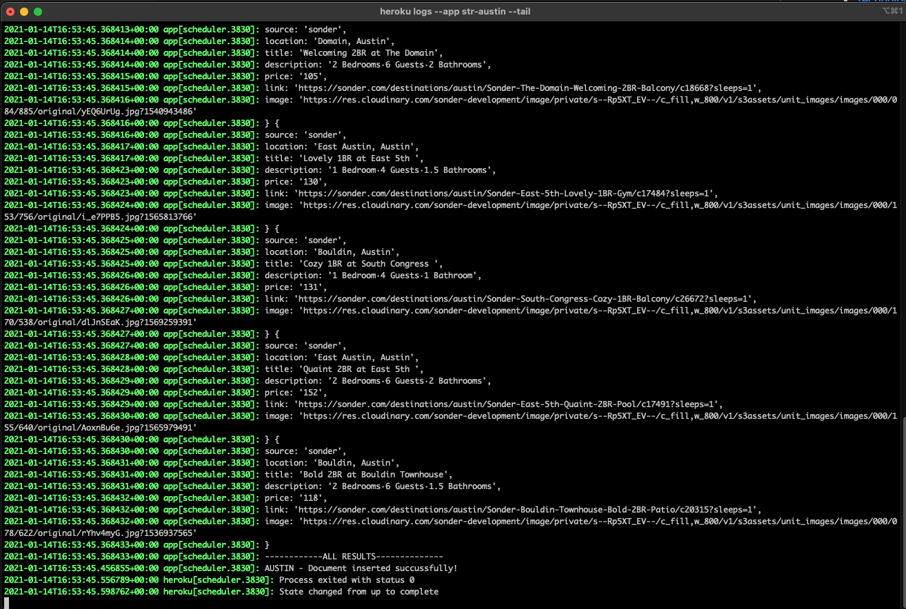
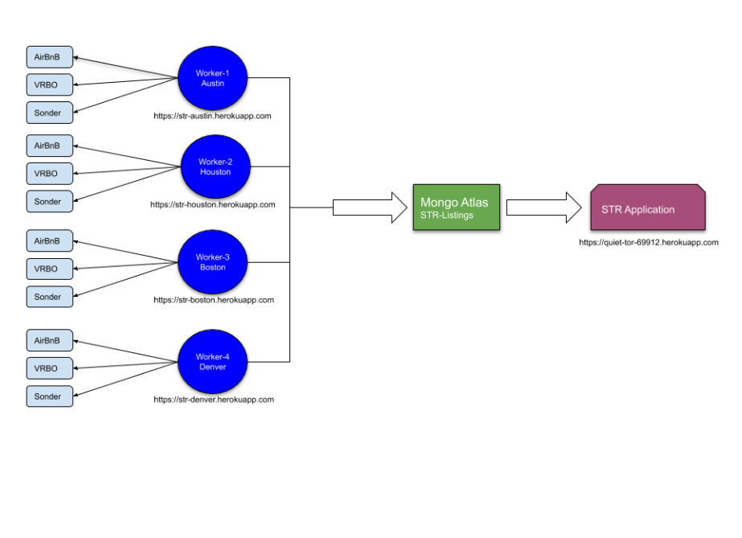

# Web workers backend for STR Aggregator 

## Project Description
This is a web scraping backend for a short term rental aggregation site.
The web scrapers here are used to create a snapshot of city listings for all three short term rental sites being targeted.  Airbnb, VRBO, and Sonder.
The front-end repo can be found here: [STR Aggregator github repo](https://github.com/etorres-revature/Pointy_Goblins.)

The web scraper uses a mixture of Puppeteer, cheerio, and axios NPM packages to pull data from the targeted websites and has been deployed to Heroku free tier dynos using a microservices type architecture one city being scraped her dyno. The results are then saved into a mongo DB database with one collection per city. 

The fully deployed application can be found at this location: [STR Aggregator frontend](https://quiet-tor-69912.herokuapp.com)

Web scrapers can be found at these locations:

https://str-austin.herokuapp.com

https://str-houston.herokuapp.com

https://str-boston.herokuapp.com

https://str-denver.herokuapp.com

## Table of Contents

  - [Project Description](#project-description)
  - [Table of Contents](#table-of-contents)
  - [Installation Instructions](#installation-instructions)
  - [Usage](#usage)
  - [Guidelines for Contributing](#guidelines-for-contributing)
  - [Tests](#tests)
  - [Technologies Used](#technologies-used)
  - [Collaborators](#collaborators)
  - [Questions](#questions)
  - [Screenshots](#screenshots)
  - [License](#license)
        
        

   
 
## Installation Instructions

Each city requires one deployment of the web scrapers to a Heroku instance.
Each Heroku instance will require a Heroku buildpack that can be installed from the Heroku CLI: 

` heroku buildpacks:add jontewks/puppeteer` 

You should see the following in settings of your Heroku instance :

You will need an Atlas Mongo DB instance and add the Config Var `MONGODB_URI` in Heroku Settings

The web scrapers utilize Heroku free scheduler add-on for the execution. You will need to add a scheduler command and add an interval of your choosing in the scheduler application. You will need to schedule the proper script for the targeted city in the scheduler. Example:

` node webscrapers/austin-PopulateAll.js`

## Usage
Please see the front end application reference in the description, to utilize the application
To monitoring the application use the following Heroku CLI commands
View logs and scheduler:
` heroku logs --app str-austin --tail`

Status and stats on remaining hours quota
`heroku ps --app str-austin`

Get working shell on dyno for troubleshooting
`heroku run bash --app str-austin`

## Guidelines for Contributing

Please e-mail one of the contributors at their address listed below with any thoughts on future updates or feature suggestions.

## Tests

Test early; test often.

## Technologies Used
Puppeteer
Cheerio 
Mongo DB 
Heroku Buildpacks
Javascript
Node js
Heroku Scheduler
Heroku CLI
## Collaborators

This _STR Aggregator_ was conceived, created, and coded by the following group of collaborators:

|                  _TEAM_                  |                 _Members_                  |
| :--------------------------------------: | :----------------------------------------: |
| :football: Vincent Doria, Jr. :football: |      :beers: Shane Schilling :beers:       |
|     :8ball: Abraham Spindel :8ball:      | :green_heart: Eric D. Torres :green_heart: |

## Questions

Check out our Github profiles:

- [Vincent Doria, Jr.](https://github.com/Cenzo-cmd);
- [Shane Schilling](https://github.com/trilambda122);
- [Abraham Spindel](https://github.com/abraspin);
- [Eric D. Torres](https://github.com/etorres-revature).

You can contact any one of use by e-mail the following:

- Vincent Doria, Jr. - vrdphone@gmail.com
- Shane Schilling - trilambda122@gmail.com
- Abraham Spindel - AbrahamSpindel@gmail.com
- Eric D. Torres - etorresntoary@gmail.com

for any additional questions and/ or clarifications you may need about the project.

## Screenshots

**Sample output from executed webscraper**

---

**Architecture overview**

## License

[This application uses the **GNU Affero General Public v3.0 License** found here](./LICENSE).

